# Voice Live On Mobile

This folder contains the mobile-hosted Voice Live solution split into five parts:

- `voice-live-avatar`: static Next.js SPA rendered inside the native hosts
- `mobile-backend`: Node.js bootstrap API that logs users in and returns Voice Live connection config
- `host-android`: Android WebView host for the SPA
- `host-ios`: iOS WKWebView host for the SPA
- `vlagent`: Azure AI Foundry agent definition used by the mobile flow

## Architecture Overview

```mermaid
flowchart LR
	subgraph NativeHosts[Native Mobile Hosts]
		AppCore[Native Core]
		MobileWebViewHost[SPA in embedded WebView / WKWebView]
	end

	VLAPI[Voice Live API]
	FoundryAgent[AI Foundry Agent]

	subgraph MobileBackendHost[Mobile Backend]
		TokenBroker[Token Broker / Session Bootstrap]
		BusinessTools[Business API]
	end
	
    EntraID[Entra ID<br>issues access token for ai.azure.com scope]

	MobileWebViewHost <-->|VLAPI Session Token| TokenBroker

	TokenBroker <-->|requests access token for managed identity| EntraID

	MobileWebViewHost <-->|"WebSocket<br>VLAPI Session Token (Auth)<br>User Session Token (Context)"| VLAPI
	VLAPI <-.-> FoundryAgent

	FoundryAgent <-->|"tool calls<br>account balance and card id"| BusinessTools

	BusinessTools -->|"card payload"| MobileWebViewHost

	TokenBroker -->|User Session Token,<br>VLAPI config| AppCore
	AppCore --> MobileWebViewHost

	classDef host fill:#d7f0ff,stroke:#227093,color:#0f172a;
	classDef web fill:#fff4cc,stroke:#a16207,color:#111827;
	classDef api fill:#e7f9e7,stroke:#2f855a,color:#0f172a;
	classDef ai fill:#fde2e4,stroke:#b83280,color:#0f172a;
	classDef identity fill:#ede9fe,stroke:#6d28d9,color:#0f172a;

	class MobileWebViewHost host;
	class AppCore host;
	class SPA web;
	class TokenBroker,BusinessTools api;
	class VLAPI,FoundryAgent ai;
	class EntraID identity;
```



## Configuration Overview

The native hosts now only need one environment-specific endpoint: the mobile backend base URL. They no longer hardcode the SPA URL.

The complete bootstrap chain is:

1. Android/iOS call `POST /login` on `mobile-backend`.
2. Android/iOS call `POST /vlapi/token` on `mobile-backend`.
3. `mobile-backend` returns the Voice Live connection config plus `config.webAppUrl`.
4. Android/iOS load the SPA from `config.webAppUrl` and inject the returned token/config into `window.connectVoiceLiveAvatar(...)`.

That means the deployment-specific URLs are configured in one place:

- Native apps know only the `mobile-backend` URL.
- `mobile-backend` knows the deployed `voice-live-avatar` URL.

## voice-live-avatar

Path: `voice-live-avatar`

What to configure:

- No build-time mobile-host-specific URL is required in the SPA itself.
- For local browser testing, use the test page/runtime UI to enter endpoint, auth, middleware, and conversation settings.
- For hosted mobile usage, the SPA is configured at runtime by the native hosts via `window.connectVoiceLiveAvatar(...)`.

Deploy with `azd` from `voice-live-avatar` if you want Azure Static Web Apps provisioning:

```bash
cd voice-live-avatar
npm install
npm run build
azd auth login
azd env new <environment-name>
azd up
```

Use the resulting static web app URL as `VOICE_LIVE_WEB_APP_URL` in the backend configuration.

## mobile-backend

Path: `mobile-backend`

Required environment variables:

```bash
AZURE_VOICELIVE_ENDPOINT=https://<your-ai-foundry-or-voice-live-endpoint>
AZURE_VOICELIVE_AGENT_NAME=<agent-name>
AZURE_VOICELIVE_PROJECT_NAME=<project-name>
VOICE_LIVE_WEB_APP_URL=https://<your-static-web-app-url>
```

Optional environment variables:

```bash
PORT=8080
AZURE_CLIENT_ID=<user-assigned-managed-identity-client-id>
```

Run locally:

```bash
cd mobile-backend
npm install
npm run dev
```

For Azure App Service deployment with `azd`:

```bash
cd mobile-backend
azd auth login
azd env new <environment-name>
azd env set AZURE_VOICELIVE_ENDPOINT "https://<your-ai-foundry-or-voice-live-endpoint>"
azd env set AZURE_VOICELIVE_AGENT_NAME "<agent-name>"
azd env set AZURE_VOICELIVE_PROJECT_NAME "<project-name>"
azd env set VOICE_LIVE_WEB_APP_URL "https://<your-static-web-app-url>"
azd up
```

`POST /vlapi/token` now requires all four values above. If one is missing, the endpoint returns a configuration error instead of incomplete bootstrap data.

## host-android

Path: `host-android`

What to configure:

- Set the mobile backend base URL through the Gradle property `voiceLiveMobileBackendUrl` or the environment variable `VOICE_LIVE_MOBILE_BACKEND_URL` before building/running the app.

Examples:

```powershell
$env:VOICE_LIVE_MOBILE_BACKEND_URL = "https://<your-mobile-backend-host>"
```

```bash
./gradlew assembleDebug -PvoiceLiveMobileBackendUrl=https://<your-mobile-backend-host>
```

The Android app reads that value into `BuildConfig.MOBILE_BACKEND_URL`. The web app URL is fetched from the backend token response and is not configured in Kotlin source anymore.

## host-ios

Path: `host-ios`

What to configure:

- Set the target build setting `MOBILE_BACKEND_URL` for the `Voice Live Blueprint` app target.
- That value is written into the generated Info.plist key `MobileBackendURL` and read at runtime by `WebAppView.swift`.

Recommended setup:

1. Open the Xcode project.
2. Select the `Voice Live Blueprint` target.
3. Open `Build Settings`.
4. Set `MOBILE_BACKEND_URL` for Debug and Release to `https://<your-mobile-backend-host>`.

The iOS app now fetches the SPA URL from `POST /vlapi/token`, so no static web app URL needs to be stored in Swift source anymore.

## vlagent

Path: `vlagent`

What to configure:

- Update the backend server URL used by the OpenAPI tool definition in `agent.yaml` to match your deployed `mobile-backend` endpoint.
- Keep that URL aligned with the same backend URL used by Android and iOS.

The agent definition is separate from the native hosts, so it is not bootstrapped automatically by the backend.